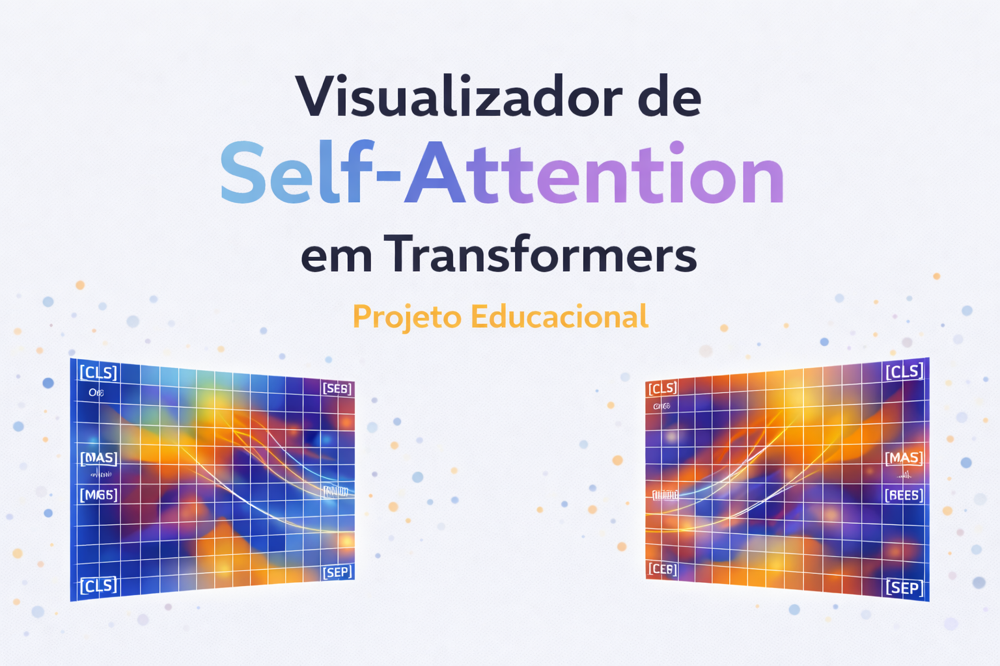

# 🧠 Visualizador de Self-Attention em transformers (Projeto Educacional)

<p align="center">
  
</p>

<p align="center">
  
  
  
  
  
  
</p>

---

## Visão Geral

Este projeto educacional explora o mecanismo de **self-attention** em modelos
**Transformer**, com foco em **clareza conceitual**, **honestidade científica**
e **visualização didática**.

Utilizando modelos pré-treinados da família **BERT**, o projeto permite:

- Extrair pesos de atenção de múltiplas camadas (*layers*) e cabeças (*heads*)
- Visualizar mapas de atenção de forma **estática** e **interativa**
- Comparar padrões de atenção entre frases semanticamente distintas
- Diferenciar explicitamente:
  - **atenção recebida** (*attention_in*) → importância contextual  
  - **atenção emitida** (*attention_out*) → atividade relacional  

⚠️ **Importante**  
Este projeto **não afirma** que atenção equivale a entendimento semântico, intencionalidade ou causalidade.  
As análises são **exploratórias**, **heurísticas** e **educacionais**.

---

## Objetivos do Projeto

- Tornar o mecanismo de self-attention observável e inspecionável
- Demonstrar compreensão prática do funcionamento interno de Transformers
- Explorar como pequenas variações textuais afetam padrões de atenção
- Servir como material de estudo, aprendizado e portfólio técnico
- Aplicar boas práticas de organização e modularização em Python

---
## Conceitos-Chave Trabalhados  
### Atenção recebida vs. atenção emitida   
Considere o tensor de atenção após a aplicação do *softmax*:    

A ∈ ℝ^(L × H × T × T)

Onde:
- **L** → número de camadas (*layers*)
- **H** → número de cabeças de atenção (*heads*)
- **T** → número de tokens da sequência

O elemento **A [l, h, i, j]** representa quanto o token **i**
atribui atenção ao token **j**, na camada **l** e cabeça **h**.

Neste projeto, duas métricas são separadas explicitamente:

- **Atenção recebida (attention_in)**  
  Soma das colunas da matriz de atenção  
  → *proxy de importância contextual*

- **Atenção emitida (attention_out)**  
  Soma das linhas da matriz de atenção  
  → *proxy de atividade relacional*

Essa separação evita confusões conceituais comuns ao interpretar mapas de atenção.

---

## 📁 Estrutura do Projeto

```text
transformer_attention_tutorial/
│
├── examples/
│   ├── step_by_step.py
│   └── compare_sentences.py
│
├── src/
│   ├── attention_extractor.py
│   ├── attention_metrics.py
│   ├── comparison.py
│   ├── interactive_visualization.py
│   ├── model_loader.py
│   └── visualization.py
│
├── assets/
│   └── banner_attention.png
│
├── README.md
└── requirements.txt
```

## Funcionalidades Implementadas

- Extração de attention weights por layer e head
- Visualização estática com Matplotlib e Seaborn
- Visualização interativa simples com Plotly
- Comparação de padrões de atenção entre frases
- Ranking automático de tokens por atenção recebida
- Separação clara entre métricas de atenção
- Suporte a modelos em português e multilíngues

## Visualizações | Estática
- Heatmaps tradicionais de atenção
- Ideal para documentação e relatórios
- Baseada em Matplotlib

### Visualização Interativa (Opcional)

Além das visualizações estáticas, o projeto inclui uma visualização interativa simples utilizando Plotly.

Essa visualização permite:
- Inspecionar valores individuais de atenção via mouse hover
- Aplicar zoom e navegar pelo mapa de atenção
- Explorar padrões locais por layer e head
- Facilitar análises qualitativas sem alterar os cálculos

#### *⚠️ Observação*    
A visualização interativa não altera o significado matemático da atenção, não adiciona novas métricas, e não substitui as figuras estáticas.   
Ela apenas oferece outra forma de inspeção visual.

A implementação com Plotly foi mantida intencionalmente simples, evitando dashboards ou aplicações web complexas.

## Como Executar o Projeto
1️⃣ Criar ambiente virtual
```
python -m venv venv
source venv/bin/activate    # Linux / Mac
venv\Scripts\activate       # Windows
```

2️⃣ Instalar dependências
```
pip install torch transformers matplotlib seaborn plotly
```
3️⃣ Executar exemplo guiado
```
python examples/step_by_step.py
```
4️⃣ Executar comparação entre frases
```
python examples/compare_sentences.py
```

## Limitações Conhecidas

- Atenção não representa causalidade;
- Atenção não equivale a entendimento semântico;
- Resultados dependem da layer e head selecionadas;
- Tokenização influencia comparações diretas entre frases;  

Essas limitações são assumidas explicitamente.

## 📌 Nota sobre o Escopo do Projeto

Este projeto não é um trabalho profissional de Ciência de Dados ou Pesquisa em IA.

Projeto desenvolvido por uma profissional da área de suprimentos, com interesse em:

* Compreender como modelos Transformer distribuem atenção;   
* Observar pesos de atenção entre tokens;     
* Estudar fundamentos de NLP e deep learning de forma prática;        

Todas as análises têm caráter exploratório, didático e não causal.  
Nenhuma interpretação cognitiva ou semântica é assumida.

## ✨ Autora
Vitória Alvares dos Santos 
### Contatos:  
[](https://www.linkedin.com/in/vitória-alvares/)  
[](mailto:Alvares26Sa@proton.me)  

### Considerações Finais   
*Este projeto foi desenvolvido com foco educacional,
priorizando clareza conceitual, honestidade metodológica
e boas práticas de engenharia de software.*     
*Ele não busca explicar o funcionamento interno completo de Transformers,
mas explorar os fundamentos da observação crítica e aprendizado.*

> Nota: o arquivo `requirements.txt` foi gerado automaticamente a partir do ambiente virtual.  
> Ele inclui dependências diretas e indiretas necessárias para execução completa do projeto.

